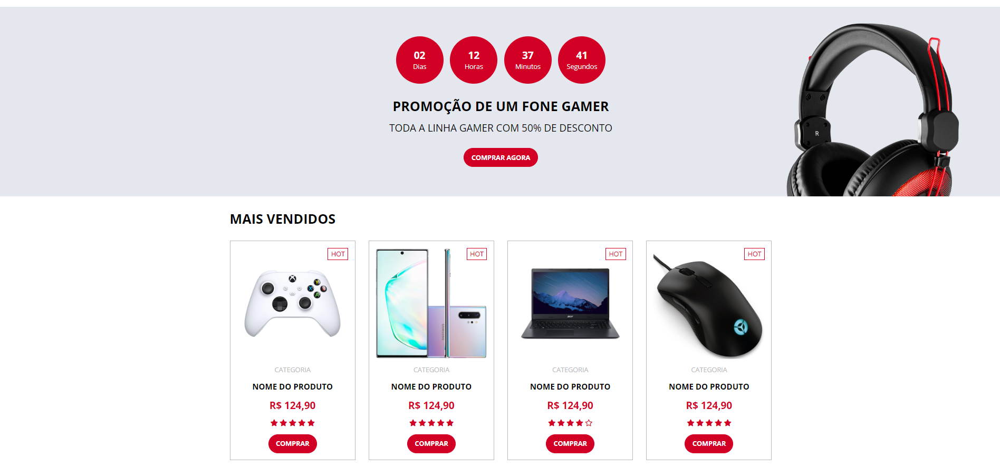

# Electrum

This project is a static page, created using HTML, CSS and SASS.

## [Click here](https://electrum-fronchak-projects.vercel.app) to go to the project page

## Requirements
* SASS

## How to set up
1. Clone this project to your machine
2. Open the terminal in the project's folder
3. Run the following command: 'sass ./assets/sass/main.sass ./public/assets/css/main.min.css --style compressed' to generate the css files
4. In the 'public' folder, open the 'index.html' file in the browser

## Images

### Header (Desktop)

### Header (Mobile)

### New products (Mobile)

### Mid (Desktop)

### Promotion (Mobile)

### Best Sellers (Mobile)

### Bottom (Desktop)

### Bottom (Mobile)

### Footer (Mobile)

